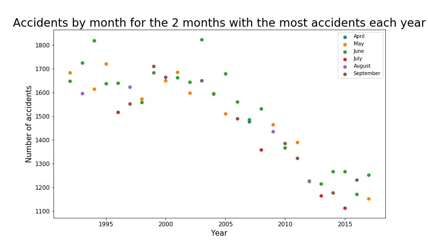

In this part, we work with the dataset df_Population_2010, which records the population by canton, sex and age between 2010 \& 2017. We change the disposition of the dataframe and group it by age and sex for each year. We then consider df_Population_Age_1992 to have access to the population by age and sex between 1992 \& 2010 and put it in the same form.

This will allow us to perform a normalization of the number of accidents (by 10'000 people in that case) to have an insight on the more dangerous categories of people.



blabla